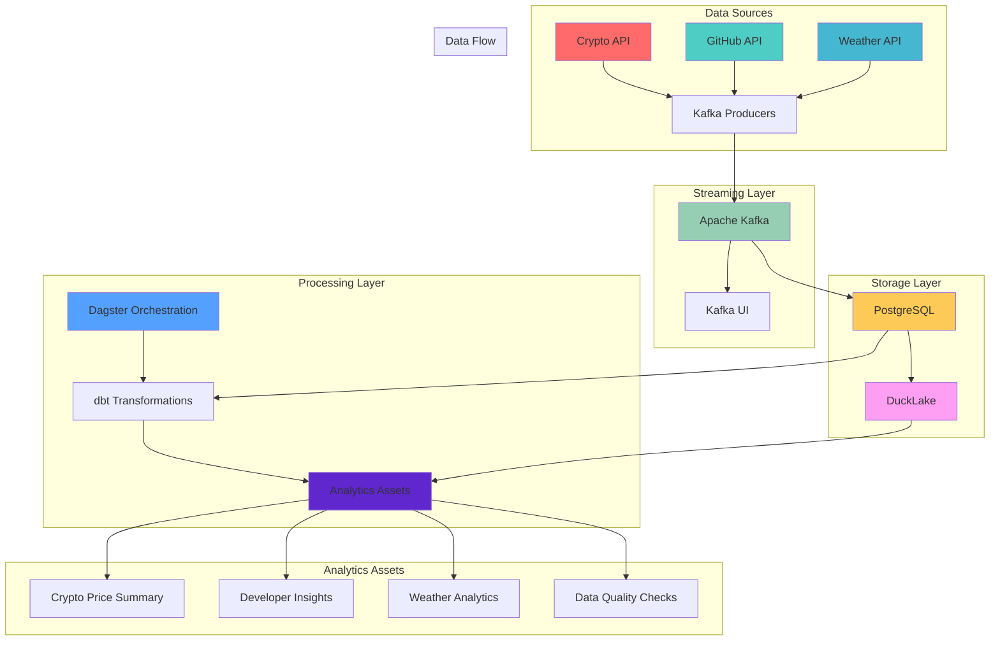

# Modern Data Stack Exercise

A comprehensive modern data stack implementation featuring real-time streaming, data transformation, analytics, and orchestration.

## 🏗️ Architecture Overview

This data stack demonstrates a complete end-to-end data pipeline with the following components:

### **Data Sources**
- **Cryptocurrency Prices** - Real-time crypto price data (Bitcoin, Ethereum, etc.)
- **GitHub Events** - Developer activity and repository events
- **Weather Data** - Multi-city weather information from OpenWeatherMap API

### **Core Technologies**

| Technology | Purpose | Port |
|------------|---------|------|
| **Apache Kafka** | Real-time message streaming and event processing | 9092 |
| **PostgreSQL** | Primary operational database for raw data storage | 5432 |
| **DuckLake (DuckDB)** | Lakehouse for analytics and data warehousing | 5433 |
| **Dagster** | Data orchestration and workflow management | 3000 |
| **dbt** | Data transformation and modeling | - |
| **Kafka UI** | Web interface for monitoring Kafka streams | 8080 |

## 🔄 Pipeline Workflow



## 📊 Data Assets

### **1. Crypto Price Summary**
- **Purpose**: Analyze cryptocurrency price trends and volatility
- **Data**: Real-time crypto prices from multiple exchanges
- **Output**: Price statistics, volatility metrics, trend analysis

### **2. Developer Insights**
- **Purpose**: Analyze GitHub developer activity patterns
- **Data**: GitHub events (pushes, pull requests, issues)
- **Output**: Top developers, activity trends, repository insights

### **3. Weather Analytics**
- **Purpose**: Analyze weather patterns across multiple cities
- **Data**: Weather data from OpenWeatherMap API
- **Output**: Temperature trends, humidity analysis, weather conditions

### **4. Data Quality Checks**
- **Purpose**: Monitor data quality and freshness
- **Data**: All data sources (crypto, GitHub, weather)
- **Output**: Data quality metrics, freshness alerts, validation results

## 🚀 Quick Start

### Prerequisites
- Docker and Docker Compose
- Python 3.8+
- Virtual environment

### 1. Clone and Setup
```bash
# Clone the repository
git clone <repository-url>
cd modern-data-stack

# Create and activate virtual environment
python -m venv datastack-env
source datastack-env/bin/activate  # On Windows: datastack-env\Scripts\activate

# Install dependencies
pip install -r requirements.txt
```

### 2. Start the Data Stack
```bash
# Make the startup script executable
chmod +x start_stack.sh

# Start all services
./start_stack.sh
```

### 3. Access the Interfaces
- **Dagster UI**: http://localhost:3000
- **Kafka UI**: http://localhost:8080
- **PostgreSQL**: localhost:5432
- **DuckLake**: localhost:5433

### 4. Materialize Assets
1. Open Dagster UI at http://localhost:3000
2. Navigate to the Assets tab
3. Select all assets and click "Materialize"
4. Monitor the execution in real-time

## 🔧 Implementation Steps

### **Step 1: Infrastructure Setup**
```bash
# Start core services
docker-compose up -d kafka postgres zookeeper kafka-ui
```

### **Step 2: Data Producers**
```bash
# Start data producers (runs automatically with start_stack.sh)
python scripts/crypto_producer.py &
python scripts/github_producer.py &
python scripts/weather_producer.py &
```

### **Step 3: Data Ingestion**
```bash
# Start Kafka to PostgreSQL consumer
python scripts/kafka_to_postgres.py &
```

### **Step 4: Data Lake Setup**
```bash
# Setup DuckLake
python scripts/setup_ducklake.py

# Stream data to DuckLake
python scripts/stream_to_ducklake.py &
```

### **Step 5: Orchestration**
```bash
# Start Dagster
cd dagster_project/datastack_orchestration
dagster dev
```

### **Step 6: Data Transformation**
```bash
# Run dbt transformations
cd dbt_project/datastack_transform
dbt run
```

## 📈 Monitoring and Observability

### **Real-time Monitoring**
- **Kafka UI**: Monitor message throughput and consumer lag
- **Dagster UI**: Track asset materialization and pipeline health
- **Data Quality**: Automated checks for data freshness and completeness

### **Data Quality Metrics**
- **Freshness**: Data should be updated within 6 hours
- **Completeness**: All required fields should be present
- **Validity**: Data should conform to expected schemas

## 🛠️ Configuration

### **Environment Variables**
```bash
# Database Configuration
POSTGRES_HOST=localhost
POSTGRES_PORT=5432
POSTGRES_DB=datastack
POSTGRES_USER=dataeng
POSTGRES_PASSWORD=dataeng123

# Kafka Configuration
KAFKA_BOOTSTRAP_SERVERS=localhost:9092

# API Keys (for production)
OPENWEATHER_API_KEY=your_api_key_here
GITHUB_TOKEN=your_github_token_here
```

### **Database Schemas**
- **raw_crypto_prices**: Cryptocurrency price data
- **raw_github_events**: GitHub activity events
- **raw_weather_data**: Weather information
- **staging_***: Transformed data for analytics

## 🔍 Troubleshooting

### **Common Issues**

1. **Port Conflicts**
   ```bash
   # Check what's using the ports
   lsof -i :3000  # Dagster
   lsof -i :9092  # Kafka
   lsof -i :5432  # PostgreSQL
   ```

2. **Docker Issues**
   ```bash
   # Restart Docker services
   docker-compose down
   docker-compose up -d
   ```

3. **Python Environment**
   ```bash
   # Ensure virtual environment is activated
   source datastack-env/bin/activate
   pip list | grep dagster
   ```

### **Logs and Debugging**
```bash
# View Docker logs
docker-compose logs kafka
docker-compose logs postgres

# View Dagster logs
dagster dev --log-level DEBUG
```

## 📚 Learning Resources

### **For Data Engineers**
- **Kafka**: [Apache Kafka Documentation](https://kafka.apache.org/documentation/)
- **Dagster**: [Dagster Documentation](https://docs.dagster.io/)
- **dbt**: [dbt Documentation](https://docs.getdbt.com/)
- **DuckDB**: [DuckDB Documentation](https://duckdb.org/docs/)

### **Key Concepts**
- **Data Streaming**: Real-time data processing patterns
- **Data Lakehouse**: Combining data lakes and warehouses
- **Data Orchestration**: Managing complex data workflows
- **Data Quality**: Ensuring reliable and trustworthy data

## 🤝 Contributing

1. Fork the repository
2. Create a feature branch
3. Make your changes
4. Add tests if applicable
5. Submit a pull request

## 📄 License

This project is licensed under the MIT License - see the LICENSE file for details.

---

**Happy Data Engineering! 🚀**
